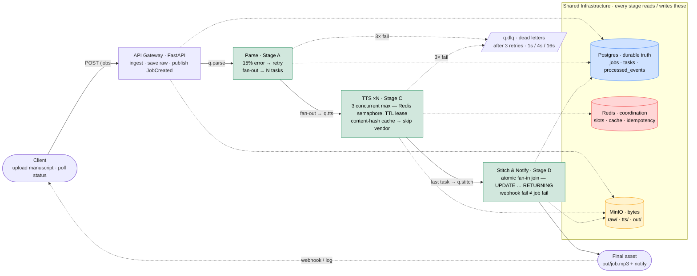

# Consuma Audio Engine — Architecture

Stage-level view of the choreographed pipeline. The diagram shows **what the system is**
and **how one job flows through it** — detail lives in a block only where that detail is a
graded design decision. Everything else (ack-ordering, idempotency keys, FSM transitions,
0/1-block edge cases) is left to the code on purpose.

## Reading the diagram

- **Solid arrows** = the event/message flow (a job moving through the broker, stage to stage).
  Queue names ride on the arrows (`q.parse`, `q.tts`, `q.stitch`) — RabbitMQ is the
  choreography backbone, not a central orchestrator.
- **Dashed arrows** = state reads/writes against the shared stores.
- **Colour = state placement** (the golden rule): Postgres = durable truth · Redis = ephemeral
  coordination · MinIO = bytes.

## Why detail sits where it does

| Block | Why it earns detail |
|-------|---------------------|
| **Parse** | The 15% injected-error rate is what exercises the retry path; fan-out into N tasks is where the parallelism (and the later fan-in problem) is born. |
| **TTS** | The two named constraints — global 3-concurrent limit (Redis semaphore) and content-hash dedup cache — are the heart of the assignment. |
| **Stitch** | The atomic fan-in join is the hardest correctness point; `webhook fail ≠ job fail` is the explicit edge case in the spec. |

Everything else stays a clean label: the reviewer reads both the diagram and the code, so the
diagram's job is the shape, not the implementation.
